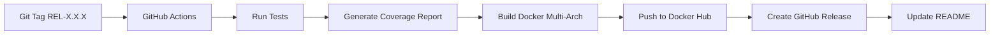

# 🐳 Docker Hub Repository Overview
## flaviomagacho/aitosql

---

## 📋 Informações Gerais

| Campo | Valor |
|-------|-------|
| **Nome da Imagem** | `flaviomagacho/aitosql` |
| **Status Atual** | ⏳ **AGUARDANDO PRIMEIRA PUBLICAÇÃO** |
| **Repositório GitHub** | [magacho/aiToSql](https://github.com/magacho/aiToSql) |
| **URL Docker Hub** | https://hub.docker.com/r/flaviomagacho/aitosql |
| **Visibilidade** | 🌍 Pública |
| **Multi-Arquitetura** | ✅ Sim (amd64, arm64) |

---

## 📦 Tags Disponíveis

Após a primeira release bem-sucedida, as seguintes tags estarão disponíveis:

| Tag | Descrição | Uso Recomendado |
|-----|-----------|-----------------|
| `latest` | Última versão estável publicada | ⚠️ Desenvolvimento |
| `0.3.0` | Versão específica 0.3.0 | ✅ Produção |
| `v0.3.0` | Versão específica com prefixo 'v' | ✅ Produção |
| `0.2.0` | Versão anterior 0.2.0 | 📦 Histórico |
| `v0.2.0` | Versão anterior com prefixo 'v' | 📦 Histórico |

### 🎯 Estratégia de Tags

```
REL-0.3.0 (Git Tag)
    ↓
Gera 3 tags Docker:
    ├─ flaviomagacho/aitosql:latest
    ├─ flaviomagacho/aitosql:0.3.0
    └─ flaviomagacho/aitosql:v0.3.0
```

---

## 🏗️ Arquiteturas Suportadas

| Arquitetura | Status | Plataforma |
|-------------|--------|------------|
| `linux/amd64` | ✅ | Intel/AMD 64-bit |
| `linux/arm64` | ✅ | Apple Silicon, ARM servers |

### 💻 Base Image
- **OS**: Ubuntu 22.04 (Jammy)
- **Java**: OpenJDK 21
- **Runtime**: Spring Boot 3.4.0

---

## 🚀 Como Usar

### 1️⃣ Pull Básico

```bash
# Última versão
docker pull flaviomagacho/aitosql:latest

# Versão específica (recomendado para produção)
docker pull flaviomagacho/aitosql:0.3.0
```

### 2️⃣ Execução Rápida (Detecção Automática de Driver)

```bash
# O driver JDBC é detectado automaticamente da URL!
docker run -d \
  --name aitosql \
  -e DB_URL="jdbc:postgresql://localhost:5432/mydb" \
  -e DB_USERNAME="readonly_user" \
  -e DB_PASSWORD="secure_password" \
  -p 8080:8080 \
  flaviomagacho/aitosql:0.3.0
```

> 🎯 **Novo!** Não é necessário especificar `DB_TYPE` - o driver é detectado automaticamente da URL JDBC.

### 3️⃣ Usando Docker Compose

#### PostgreSQL
```yaml
version: '3.8'
services:
  aitosql:
    image: flaviomagacho/aitosql:0.3.0
    environment:
      DB_URL: jdbc:postgresql://postgres:5432/mydb
      DB_USERNAME: readonly_user
      DB_PASSWORD: secure_password
      # DB_TYPE não é mais necessário - detectado automaticamente!
    ports:
      - "8080:8080"
    depends_on:
      - postgres
  
  postgres:
    image: postgres:15-alpine
    environment:
      POSTGRES_DB: mydb
      POSTGRES_USER: admin
      POSTGRES_PASSWORD: admin123
    ports:
      - "5432:5432"
```

#### MySQL
```yaml
version: '3.8'
services:
  aitosql:
    image: flaviomagacho/aitosql:0.3.0
    environment:
      DB_URL: jdbc:mysql://mysql:3306/mydb
      DB_USERNAME: readonly_user
      DB_PASSWORD: secure_password
      # DB_TYPE não é mais necessário - detectado automaticamente!
    ports:
      - "8080:8080"
    depends_on:
      - mysql
  
  mysql:
    image: mysql:8
    environment:
      MYSQL_DATABASE: mydb
      MYSQL_ROOT_PASSWORD: rootpass
      MYSQL_USER: readonly_user
      MYSQL_PASSWORD: secure_password
    ports:
      - "3306:3306"
```

---

## 🔧 Variáveis de Ambiente

| Variável | Obrigatória | Descrição | Exemplo |
|----------|-------------|-----------|---------|
| `DB_URL` | ✅ | JDBC connection URL | `jdbc:postgresql://host:5432/db` |
| `DB_USERNAME` | ✅ | Database username (READ-ONLY) | `readonly_user` |
| `DB_PASSWORD` | ✅ | Database password | `secure_password` |
| `DB_TYPE` | ⭐ | Database type (auto-detectado) | `postgresql`, `mysql`, `oracle`, `sqlserver` |
| `SERVER_PORT` | ❌ | Porta do servidor (padrão: 8080) | `8080` |
| `SPRING_PROFILES_ACTIVE` | ❌ | Spring profiles | `prod` |

### 🎯 Detecção Automática de Driver JDBC

**Novidade na v0.3.0+**: O driver JDBC é **automaticamente detectado** da URL!

#### Bancos Suportados:
- ✅ **PostgreSQL**: `jdbc:postgresql://...` → `org.postgresql.Driver`
- ✅ **MySQL**: `jdbc:mysql://...` → `com.mysql.cj.jdbc.Driver`
- ✅ **SQL Server**: `jdbc:sqlserver://...` → `com.microsoft.sqlserver.jdbc.SQLServerDriver`
- ✅ **Oracle**: `jdbc:oracle:...` → `oracle.jdbc.OracleDriver`

#### Como Funciona:
```bash
# ❌ ANTES: Era necessário especificar o driver
docker run -e DB_URL="..." -e DB_TYPE="postgresql" ...

# ✅ AGORA: Driver detectado automaticamente
docker run -e DB_URL="jdbc:postgresql://..." ...
```

> 💡 **Dica**: Você ainda pode usar `DB_TYPE` se preferir ser explícito, mas não é mais obrigatório!

Para mais detalhes, veja: [JDBC Driver Auto-Detection](JDBC_DRIVER_AUTO_DETECTION.md)

### ⚠️ Segurança
- **SEMPRE** use um usuário com permissões **READ-ONLY** (SELECT apenas)
- Evite expor credenciais no código ou logs
- Use secrets management em produção (Kubernetes secrets, AWS Secrets Manager, etc.)

---

## 📊 Endpoints da API

### 1️⃣ Health Check
```bash
GET http://localhost:8080/actuator/health
```

### 2️⃣ Schema Introspection
```bash
GET http://localhost:8080/api/mcp/model-context
```
Retorna a estrutura completa do banco de dados.

### 3️⃣ Execute Query
```bash
POST http://localhost:8080/api/mcp/execute-search
Content-Type: application/json

{
  "sql": "SELECT * FROM users LIMIT 10"
}
```

### 4️⃣ Table Details
```bash
GET http://localhost:8080/api/mcp/table-details?tableName=users
```

### 5️⃣ List Triggers
```bash
GET http://localhost:8080/api/mcp/triggers?tableName=orders
```

---

## 📈 Estatísticas e Métricas

### Tamanho da Imagem (Estimado)
```
Camadas:
├─ Ubuntu Jammy base: ~30MB
├─ OpenJDK 21: ~200MB
├─ Application JAR: ~50MB
└─ Total comprimido: ~150MB
```

### Performance
- **Startup time**: ~5-10 segundos
- **Memory footprint**: ~256MB-512MB (ajustável via JVM options)
- **CPU**: Mínimo 0.5 cores

---

## 🔄 Pipeline de Publicação

### Workflow Automatizado



### Gatilhos (Triggers)
- **Build**: A cada commit no `main`
- **Publish**: Apenas em tags `REL-X.X.X`

---

## 📜 Histórico de Versões

| Versão | Data | Status | Notas |
|--------|------|--------|-------|
| **0.3.0** | 2025-10-29 | 🔄 Em Progresso | Multi-arch support (arm64) |
| **0.2.0** | 2025-10-28 | ⏳ Aguardando | Docker containerization |
| **0.1.0** | 2025-10-28 | ⏳ Aguardando | Initial release |

---

## 🐛 Troubleshooting

### Problema: Container não inicia
```bash
# Verificar logs
docker logs aitosql

# Verificar conectividade com banco
docker exec -it aitosql curl -s http://localhost:8080/actuator/health
```

### Problema: Erro de conexão com banco
- ✅ Verifique se `DB_URL` está correto
- ✅ Confirme que o banco está acessível do container
- ✅ Use `host.docker.internal` para acessar localhost do host

### Problema: Permissão negada
- ✅ Verifique se o usuário tem permissões SELECT
- ✅ Confirme que o firewall permite conexões

---

## 🔐 Secrets Necessárias (GitHub Actions)

Para publicar no Docker Hub, configure as seguintes secrets:

```bash
# Listar secrets
gh secret list

# Criar secrets
gh secret set DOCKERHUB_USERNAME --body "magacho"
gh secret set DOCKERHUB_TOKEN --body "seu-token-aqui"
```

### Como Obter Token do Docker Hub
1. Acesse https://hub.docker.com/settings/security
2. **New Access Token**
3. Nome: `github-actions-aitosql`
4. Permissões: **Read, Write, Delete**
5. Copie o token e configure no GitHub

---

## 🎯 Roadmap de Publicação

### ✅ Fase 1: Preparação (Concluída)
- [x] Dockerfile otimizado
- [x] Multi-arquitetura (amd64, arm64)
- [x] Workflow GitHub Actions
- [x] Docker Compose examples

### 🔄 Fase 2: Primeira Publicação (Em Progresso)
- [ ] Configurar secrets Docker Hub
- [ ] Criar tag REL-0.3.0
- [ ] Validar publicação
- [ ] Testar pull e execução

### 📋 Fase 3: Documentação
- [ ] README no Docker Hub
- [ ] Exemplos de uso
- [ ] Badges de status

---

## 🔗 Links Úteis

| Recurso | URL |
|---------|-----|
| **Docker Hub** | https://hub.docker.com/r/flaviomagacho/aitosql |
| **GitHub Repo** | https://github.com/magacho/aiToSql |
| **GitHub Actions** | https://github.com/magacho/aiToSql/actions |
| **Issues** | https://github.com/magacho/aiToSql/issues |
| **Releases** | https://github.com/magacho/aiToSql/releases |

---

## 📞 Suporte

- 🐛 **Bugs**: [GitHub Issues](https://github.com/magacho/aiToSql/issues)
- 💬 **Discussões**: [GitHub Discussions](https://github.com/magacho/aiToSql/discussions)
- 📧 **Contato**: magacho@example.com

---

## 📄 Licença

Este projeto é open source. Veja o arquivo LICENSE no repositório para mais detalhes.

---

**Última Atualização**: 2025-10-29
**Mantido por**: Flavio Magacho (@magacho)
