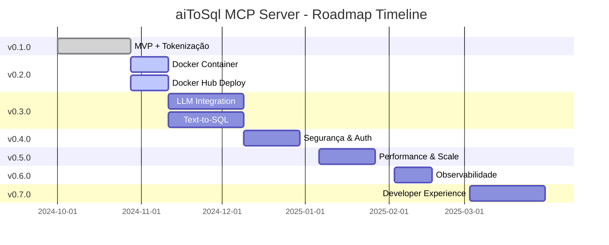

# 🗺️ Roadmap Visual - aiToSql MCP Server

**Última Atualização**: 28 de Outubro de 2024  
**Status**: v0.2.0 em progresso (Docker deployment)

---

## 📊 Progresso Geral

```
v0.1.0 ████████████████████ 100% ✅ COMPLETO
v0.2.0 ██████░░░░░░░░░░░░░░  30% 🔄 EM PROGRESSO (Docker)
v0.3.0 ░░░░░░░░░░░░░░░░░░░░   0% ⏳ PLANEJADO (LLMs)
v0.4.0 ░░░░░░░░░░░░░░░░░░░░   0% ⏳ PLANEJADO (Segurança)
v0.5.0 ░░░░░░░░░░░░░░░░░░░░   0% 🔮 FUTURO (Performance)
v0.6.0 ░░░░░░░░░░░░░░░░░░░░   0% 🔮 FUTURO (Observabilidade)
v0.7.0 ░░░░░░░░░░░░░░░░░░░░   0% 🔮 FUTURO (Developer UX)
```

---

## 🎯 Timeline



---

## 🎖️ Releases

### ✅ v0.1.0 - MVP (28/Out/2024)

**Status**: Completo  
**Cobertura**: 74%  
**Testes**: 31/31 ✅

**Entregas**:
- [x] Protocolo MCP JSON-RPC 2.0
- [x] 4 ferramentas MCP (schema, tables, triggers, query)
- [x] Suporte multi-banco (PostgreSQL, MySQL, Oracle, MSSQL)
- [x] Sistema de tokenização
- [x] Performance metrics
- [x] Teste E2E completo
- [x] CI/CD GitHub Actions

---

### 🔄 v0.2.0 - Docker Deployment (Em Progresso)

**Status**: 30% completo  
**Prazo**: 11/Nov/2024  
**Meta Cobertura**: 78%

**Objetivos**:
- [ ] 🐳 Dockerfile multi-stage otimizado
- [ ] 📦 Docker Hub: `magacho/aitosql-mcp-server`
- [ ] ⚙️ Configuração 100% via ENV
- [ ] 🔧 Suporte a 4 bancos no container
- [ ] 📝 Documentação completa
- [ ] ✅ Testes automatizados

**Progresso Atual**:
- [x] Dockerfile criado
- [x] Docker Compose (PostgreSQL + MySQL)
- [x] Scripts de inicialização
- [x] application-docker.properties
- [x] Drivers multi-banco no POM
- [x] GitHub Actions workflow
- [x] Documentação (DOCKER_DEPLOYMENT.md)
- [x] DOCKER_README.md para Docker Hub
- [x] Script de teste (test-docker-deployment.sh)
- [ ] **Próximo**: Testar build local
- [ ] **Próximo**: Push para Docker Hub
- [ ] **Próximo**: Atualizar cobertura de testes

---

### ⏳ v0.3.0 - LLM Integration (Planejado)

**Status**: Não iniciado  
**Prazo**: 09/Dez/2024  
**Meta Cobertura**: 82%

**Objetivos**:
- [ ] 🤖 OpenAI GPT-4 integration
- [ ] 🤖 Anthropic Claude integration
- [ ] 🤖 Google Gemini integration
- [ ] 🤖 Ollama (modelos locais)
- [ ] 🧠 Text-to-SQL (naturalLanguageQuery)
- [ ] 📊 Cost tracking dashboard

---

### ⏳ v0.4.0 - Security & Auth (Planejado)

**Status**: Não iniciado  
**Prazo**: 30/Dez/2024  
**Meta Cobertura**: 86%

**Objetivos**:
- [ ] 🔐 API Key authentication
- [ ] 🔐 JWT authentication (opcional)
- [ ] 👥 RBAC (role-based access control)
- [ ] 🚦 Rate limiting
- [ ] 💰 Cost-based throttling
- [ ] 📝 Audit logging

---

### 🔮 v0.5.0 - Performance (Futuro)

**Prazo**: Jan/2025  
**Meta Cobertura**: 90%

- Redis cache distribuído
- Async processing
- Multi-tenancy

---

### 🔮 v0.6.0 - Observability (Futuro)

**Prazo**: Fev/2025  
**Meta Cobertura**: 92%

- Prometheus + Grafana
- Distributed tracing
- Alertas e SLOs

---

### 🔮 v0.7.0 - Developer UX (Futuro)

**Prazo**: Mar/2025  
**Meta Cobertura**: 94%

- SDKs (Python, TypeScript, Go)
- CLI tool
- Web dashboard

---

## 📈 Evolução da Cobertura

```
v0.1.0: 74% ████████████████░░░░  ✅ ALCANÇADO
v0.2.0: 78% ██████████████████░░  🎯 META
v0.3.0: 82% ████████████████████  🎯 META
v0.4.0: 86% █████████████████████ 🎯 META
v0.5.0: 90% █████████████████████ 🎯 META
v0.6.0: 92% █████████████████████ 🎯 META
v0.7.0: 94% █████████████████████ 🎯 META
```

---

## 🎯 Próximos Passos (v0.2.0)

### Esta Semana
1. ✅ Criar Dockerfile multi-stage
2. ✅ Criar docker-compose para PostgreSQL e MySQL
3. ✅ Adicionar drivers JDBC ao POM
4. ✅ Criar application-docker.properties
5. ✅ Criar GitHub Actions workflow
6. ✅ Escrever documentação Docker
7. ⏳ **Testar build local do Docker**
8. ⏳ **Configurar secrets no GitHub (DOCKERHUB_USERNAME, DOCKERHUB_TOKEN)**
9. ⏳ **Push para Docker Hub**
10. ⏳ **Testar imagem do Docker Hub**

### Próxima Semana
11. ⏳ Adicionar testes para validação de ENV vars
12. ⏳ Documentar exemplos de uso para cada banco
13. ⏳ Criar vídeo demo (opcional)
14. ⏳ Atualizar README principal
15. ⏳ **Gerar release v0.2.0**

---

## 💡 Insights da Mudança

### Por que Docker primeiro, depois LLM?

**Decisão Estratégica**: Priorizar deployment sobre integração LLM.

**Motivos**:
1. ✅ **Facilita Testing**: Outros desenvolvedores podem testar facilmente
2. ✅ **Produção-Ready**: Deployment é crítico para uso real
3. ✅ **Modular**: LLMs podem ser integrados depois sem afetar deployment
4. ✅ **Feedback Rápido**: Docker permite feedback da comunidade mais cedo

### Integração LLM - Como Funciona?

```
┌─────────────┐
│   LLM Host  │  (Claude, GPT-4, Gemini)
│ (Desktop AI)│
└──────┬──────┘
       │ MCP Protocol (JSON-RPC 2.0)
       │ http://your-server:8080/mcp/tools/call
       │
┌──────▼──────────────┐
│  MCP Server (Docker)│  ← Nossa aplicação
│  magacho/aitosql   │
└──────┬──────────────┘
       │ JDBC (READ-ONLY)
       │
┌──────▼──────┐
│  Database   │  (PostgreSQL, MySQL, etc)
└─────────────┘
```

**Fluxo**:
1. LLM envia requisição JSON-RPC para o MCP Server
2. MCP Server interage com banco via JDBC
3. MCP Server retorna dados tokenizados
4. LLM processa e gera resposta ao usuário

**Configuração do LLM** (futuro):
```json
{
  "mcp_servers": {
    "database": {
      "url": "http://your-server:8080",
      "tools": ["getSchemaStructure", "secureDatabaseQuery"]
    }
  }
}
```

---

## 🤝 Como Contribuir Agora

### Áreas Atuais (v0.2.0):
1. 🐳 **Docker Testing**: Testar em diferentes ambientes
2. 📝 **Documentação**: Melhorar exemplos e tutoriais
3. 🐛 **Bug Reports**: Reportar problemas com Docker
4. 💡 **Sugestões**: ENV vars adicionais necessárias?

### Próximas Áreas (v0.3.0):
5. 🤖 **LLM Testing**: Testar com diferentes LLMs
6. 📊 **Prompt Engineering**: Otimizar prompts para Text-to-SQL
7. 💰 **Cost Analysis**: Analisar custos reais de API

---

## 📞 Links Úteis

- **Repositório**: https://github.com/magacho/aiToSql
- **Issues**: https://github.com/magacho/aiToSql/issues
- **Docker Hub**: https://hub.docker.com/r/magacho/aitosql-mcp-server (em breve)
- **Discussions**: https://github.com/magacho/aiToSql/discussions

---

**Última atualização**: 28 de Outubro de 2024, 20:00 UTC  
**Próxima revisão**: Após release v0.2.0
